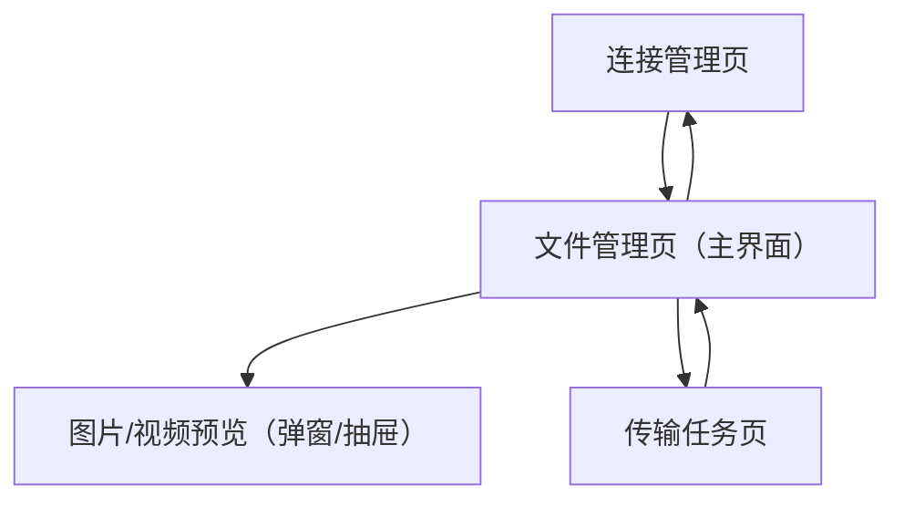

## 1. Product Overview

WebDAV-Mate 是一款 Electron 桌面端 WebDAV 文件管理工具，帮助你在多个 WebDAV 服务之间高效管理文件与传输任务。
它提供网格化浏览、拖拽上传/移动/复制、批量上传下载进度管理，以及图片/视频预览。

## 2. Core Features

### 2.1 User Roles

| 角色             | 使用方式                       | 核心权限                                                                                            |
| ---------------- | ------------------------------ | --------------------------------------------------------------------------------------------------- |
| 本地用户（单机） | 本地安装后直接使用（无需注册） | 可添加/编辑多个 WebDAV 连接，浏览与管理文件，执行上传/下载/删除/移动/重命名，查看传输进度与媒体预览 |

### 2.2 Feature Module

本产品由以下主要页面组成：

1. **连接管理页**：新增/编辑/切换 WebDAV 服务、连接测试、默认连接设置。
2. **文件管理页（主界面）**：文件网格展示、目录导航、拖拽操作、批量上传/下载、图片/视频预览。
3. **传输任务页**：上传/下载队列、总体与单任务进度、暂停/继续/取消、失败重试与错误提示。

### 2.3 Page Details

| Page Name            | Module Name       | Feature description                                                                                   |
| -------------------- | ----------------- | ----------------------------------------------------------------------------------------------------- |
| 连接管理页           | WebDAV 连接列表   | 展示已保存连接；支持选择当前连接；标记默认连接                                                        |
| 连接管理页           | 新增/编辑连接     | 录入名称、服务器 URL、用户名、密码（或应用密码）；选择基础路径（可选）；保存到本地                    |
| 连接管理页           | 连接测试          | 发起连接测试并提示结果；失败时展示可读错误信息（如鉴权失败/超时/证书问题）                            |
| 文件管理页（主界面） | 顶部工具栏        | 显示当前连接与路径；提供返回/刷新；提供上传/下载入口与选择模式切换                                    |
| 文件管理页（主界面） | 目录导航          | 浏览文件夹层级；支持进入/返回；在路径变化时刷新列表                                                   |
| 文件管理页（主界面） | 文件网格列表      | 以网格卡片展示文件/文件夹（名称、类型、大小、修改时间的精简信息）；支持排序（名称/时间）              |
| 文件管理页（主界面） | 选择与批量操作    | 支持多选（Ctrl/Shift 或勾选）；对选中项执行下载、删除、重命名（单项）、移动（拖拽或操作入口）         |
| 文件管理页（主界面） | 拖拽操作          | 从本机拖入窗口触发上传；在网格内拖拽文件到文件夹执行移动（同服务内）；拖拽时显示目标高亮与禁止态      |
| 文件管理页（主界面） | 批量上传/下载发起 | 选择本机文件/文件夹并加入队列；对选中文件/文件夹发起下载并加入队列                                    |
| 文件管理页（主界面） | 图片/视频预览     | 点击图片/视频文件打开预览；支持上一张/下一张（同目录）；视频支持播放/暂停/进度条                      |
| 传输任务页           | 队列与进度        | 展示上传/下载队列；显示单任务进度、速度（可选）、剩余时间（可选）、状态（排队/进行中/完成/失败/暂停） |
| 传输任务页           | 控制操作          | 支持暂停/继续/取消单任务；支持失败重试；支持清理已完成记录                                            |
| 传输任务页           | 错误与冲突提示    | 失败时展示原因；遇到同名文件时提示处理方式（覆盖/跳过/重命名）并应用到本次批量任务（可选）            |

## 3. Core Process

**连接管理与切换流程**

1. 你进入连接管理页，新增一个 WebDAV 连接并执行连接测试。
2. 保存后，你选择该连接为“当前连接”，并进入文件管理页。
3. 你可随时返回连接管理页切换其他连接，文件管理页随连接变化刷新。

**文件浏览与预览流程**

1. 你在文件管理页通过网格浏览目录。
2. 点击文件夹进入下一级；点击图片/视频文件进入预览。
3. 预览中可在同目录媒体文件间切换，关闭预览返回网格。

**批量上传流程（拖拽/选择）**

1. 你将本机文件/文件夹拖入文件管理页（或通过“上传”选择）。
2. 系统创建上传任务并加入传输队列。
3. 你在传输任务页查看整体与单任务进度，必要时暂停/继续/取消。

**批量下载流程**

1. 你在文件管理页多选文件/文件夹并点击“下载”。
2. 系统创建下载任务并加入队列，按队列执行。
3. 你在传输任务页查看进度与结果，失败可重试。

