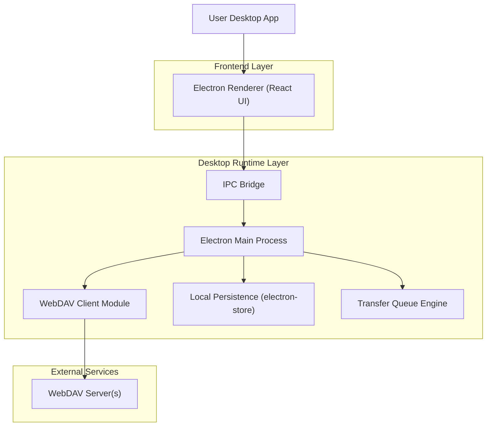
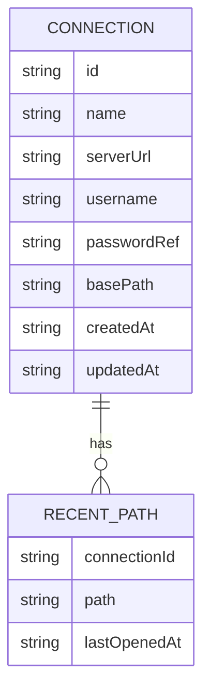

## 1.Architecture design



## 2.Technology Description

- Frontend (Renderer): React@18 + TypeScript + Vite + TailwindCSS
- Desktop Runtime: Electron
- Backend: None（本地桌面应用；通过 Electron Main Process 负责网络与文件系统访问）
- WebDAV: Node 侧 WebDAV client SDK（用于 PROPFIND/GET/PUT/MOVE/DELETE 等）
- Local Storage: electron-store（保存多连接配置、最近路径、偏好设置）

## 3.Route definitions

| Route            | Purpose                                                   |
| ---------------- | --------------------------------------------------------- |
| /servers         | 连接管理页：管理多个 WebDAV 服务、测试连接、切换当前连接  |
| /files/:serverId | 文件管理页：网格浏览、拖拽上传/移动、批量操作、预览入口   |
| /transfers       | 传输任务页：上传/下载队列与进度、暂停/继续/取消、失败重试 |

## 4.API definitions (If it includes backend services)

不涉及独立后端服务；仅定义 Renderer ↔ Main 的 IPC 契约（TypeScript 类型），便于模块解耦与测试。

### 4.1 Core IPC Contracts

```ts
export type WebDavConnection = {
  id: string
  name: string
  serverUrl: string
  username: string
  /** 加密存储；Renderer 不应直接读取明文 */
  passwordRef?: string
  basePath?: string
  createdAt: string
  updatedAt: string
}

export type RemoteEntry = {
  path: string // /remote.php/dav/files/xxx/a.jpg
  name: string
  kind: 'file' | 'folder'
  size?: number
  contentType?: string
  lastModified?: string
}

export type TransferKind = 'upload' | 'download'
export type TransferStatus = 'queued' | 'running' | 'paused' | 'done' | 'failed' | 'canceled'

export type TransferTask = {
  id: string
  kind: TransferKind
  serverId: string
  remotePath: string
  localPath: string
  totalBytes?: number
  transferredBytes: number
  status: TransferStatus
  errorMessage?: string
  createdAt: string
}
```

IPC（示例命名）

- connections.list / connections.upsert / connections.remove / connections.test
- files.list(serverId, path) / files.delete / files.move / files.rename
- transfer.enqueueUpload / transfer.enqueueDownload / transfer.pause / transfer.resume / transfer.cancel
- preview.getMediaUrl（返回 file:// 临时缓存路径或自定义协议 URL）

## 5.Server architecture diagram (If it includes backend services)

无独立服务端。

## 6.Data model(if applicable)

### 6.1 Data model definition

本地持久化数据（逻辑模型；使用 electron-store 持久化为 JSON，避免引入数据库）：



### 6.2 Data Definition Language

不使用数据库，因此不提供 DDL。
